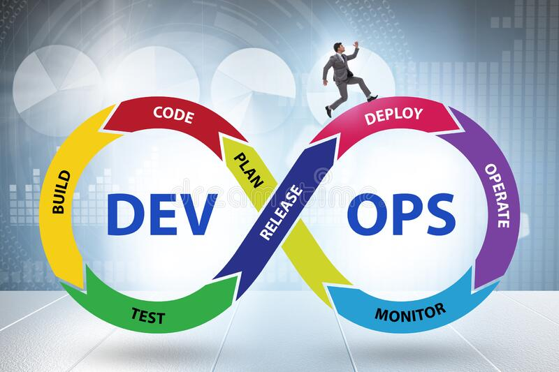

# JOURNEY OF 100 DAYS OF DEVOPS AND CLOUD LEARNING

                                                            |

<!-- | [DevOps Bootcamp](https://www.techworld-with-nana.com/devops-bootcamp)                                                    | 🚧                   |
| [AWS Cloud Practioner](https://digitalcloud.training/aws-certified-cloud-practitioner/)                                   | 🚧                   |
| [VPC Detailed Course](https://www.youtube.com/watch?v=g2JOHLHh4rI&t=1802s)                                                | ✔️                   | -->

 

# Note

DevOps is a more theoretial as compared to programming. So, all these devops notes will just be a summary of my understanding of devops concepts.

I will include all the learning resources, code snippets and command whenever necessary.

 

# Directory Structure

All the root-level folders contain `ReadMe` file and `notes` folder.

notes directory contains multiple files. Each file is a detailed note on a particular topic.

ReadMe file arranges those files in a sequential manner.

It is advised to go through ReadMe instead of going through individual notes.

 

[Devops Introduction](./devops-overview)
