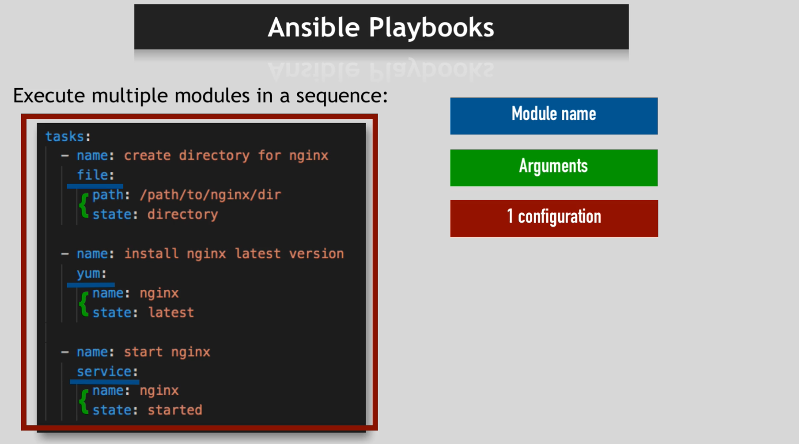
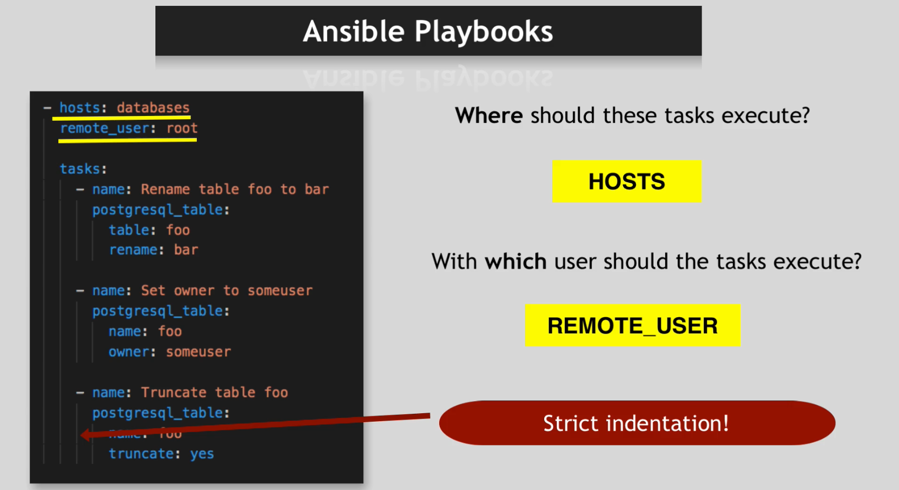
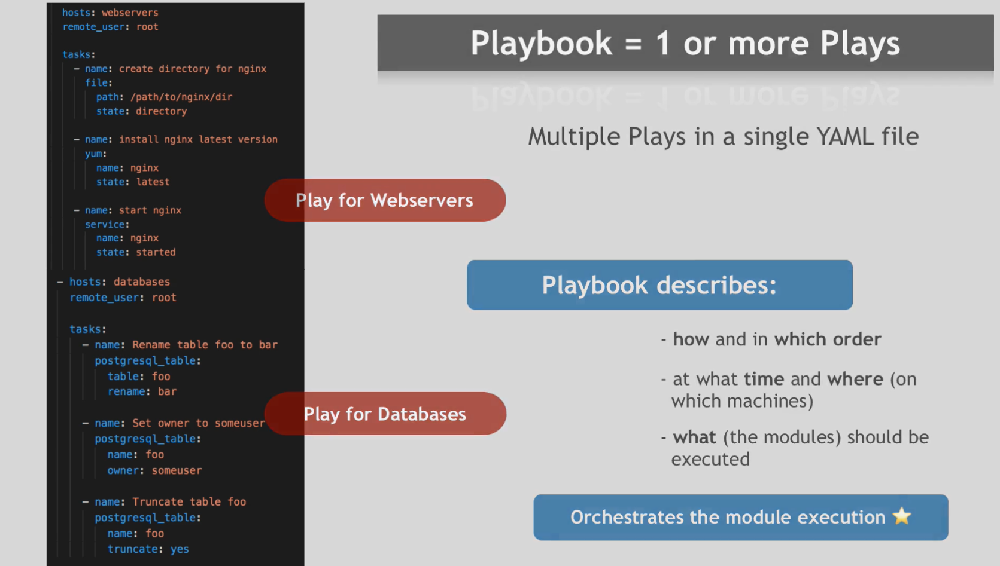
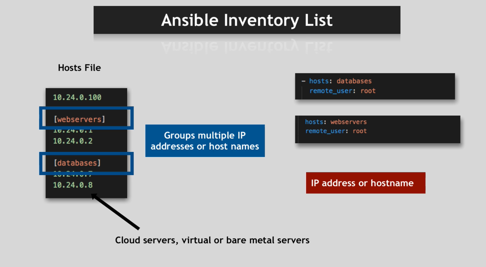

Ansible is a tool that helps you automate different IT task.
Ansible can be used to manage tasks on multiple servers.

If you have a application running in multiple macines and you want to update some software to all the machines, you could do that using ansible.

Other tasks such as Backups, system reboots, running some terminal commands etc can also be automated using ansible.

With Ansible,

- Instead of doing ssh into all the machines individually and performing commands manually , you can automate it through ansible.
- Instead of running multiple shell scripts and commands one by one, you can automate this process through a YAML file.
- If you want to create identical environments, you can use the same script in all the servers.
- It is more reliable and less prone to error.

Ansible supports all Operating system and all tasks including any IT/System Administration tasks.
Another advantage of ansible is that you dont need to install any softwares on the target machine. You only need to make necessary arrangements so that ansible can ssh into servers.

ansible works with modules. a module is a program that performs a very small task such as copying a file, installing a server, start a docker container etc.

ansible copies all the modules to the target machine and executes it. It then deletes the modules once the task is completed.

as module are very small, you will need a collection of modules grouped together in a certain sequence to perform a certain task.

a task is a group of modules aranged in a certain sequence. a module has a name, arguments and description.

we should also specify the host and remote user to execute a task

you can also define multiple variables inside ansible scripts and use them inside script.

the combination of which task, which host and which user formes a term called play. In a single YAML file, you can have multiple play, hence the file is also known as playbook.

ansible has a file called hosts file. this file lists all the IP address of the server. The server are arranged in groups. We then refer to this group in a play. Tasks in a play gets executed in all the servers listed under the group.

You can either use IP addresses or DNS name to refer to the server. The server could be a database server, web server or any other server.

All the servers listed in this file are also called Inventory.

Ansible can manage both the application (dockerized/with-out dockerized) and host.

Ansible has a GUI interface called Ansible Tower created by Redhat. This interface is used to centrally locate all the automation tasks across all the teams, manage permissions to team members, manage inventory etc.

There are other alternatives of ansible such as Puppet or Chef.
ansible uses yaml syntax wheras puppet and chef use ruby.
ansible is agentless whereas puppet and chef require agent installtion on remote machine.

ansible is generally either installed on the local machine or is installed on one of the remote machines. if your servers are not connected to the internet and are in a private network, then you will need to install ansible in that same network. you would then manage this server through your local machine. the machine where you install ansible is called control node. control node will manage other servers known as managed nodes. managed nodes will need to install python to run ansible code.
