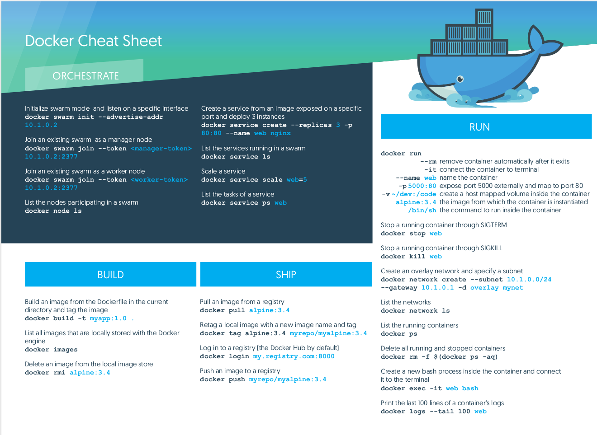
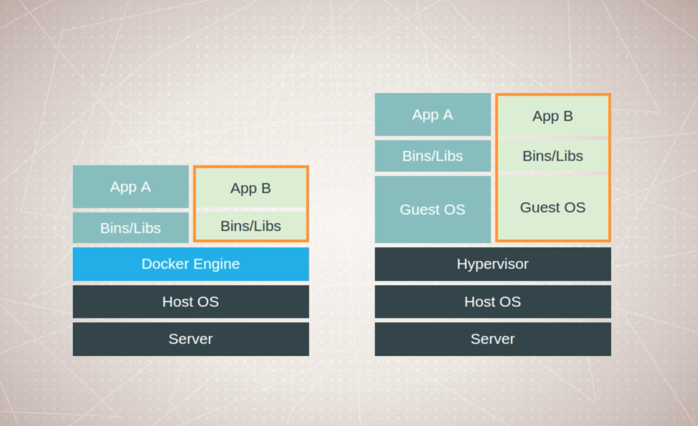
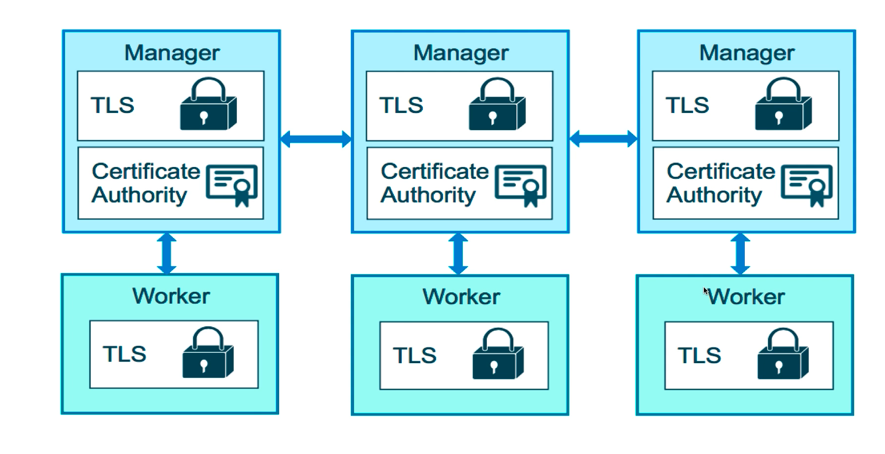
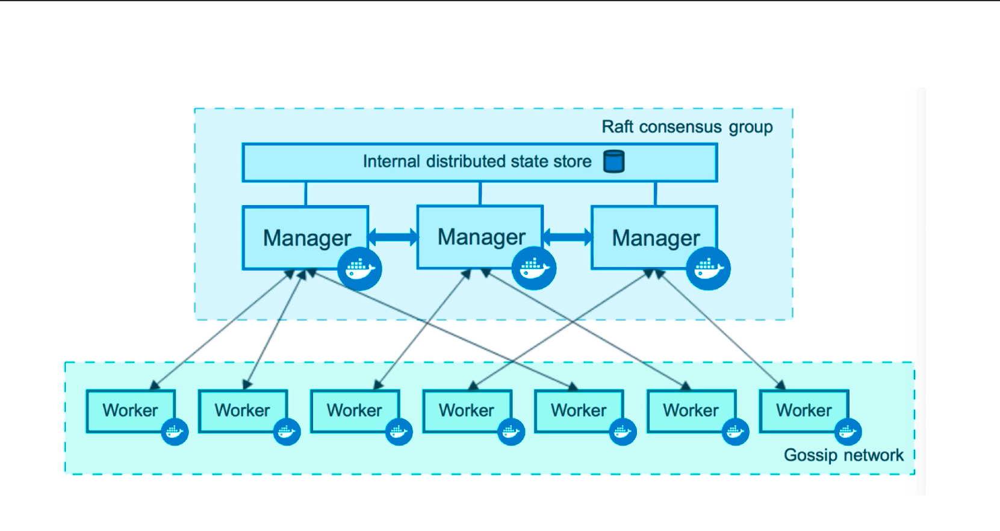
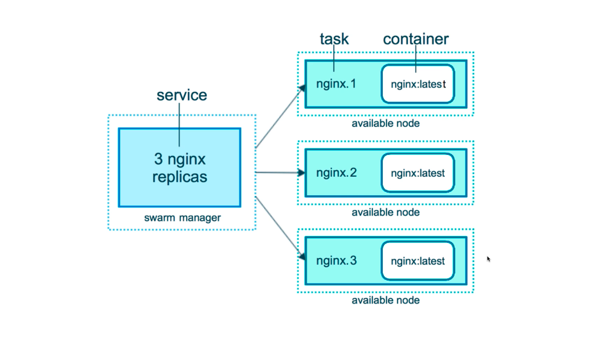
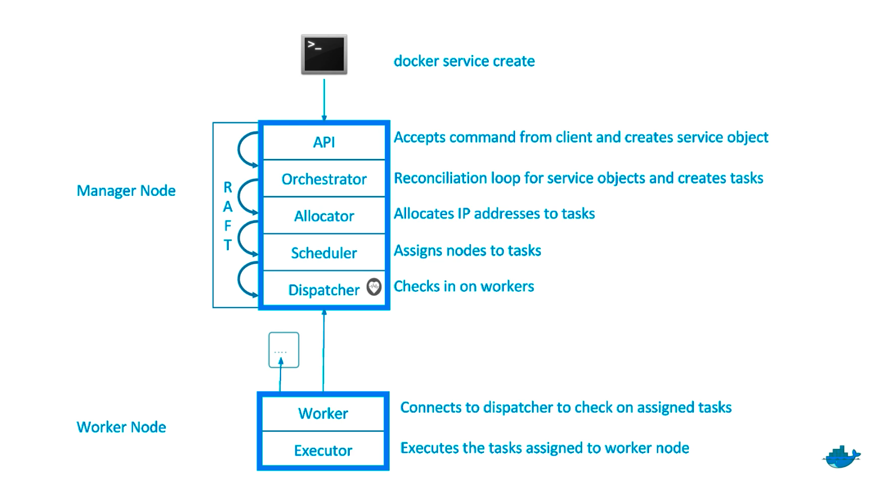

# Lets say you have 2 applications in a virtual machine. Both application require a configuration file called 'file1.py' in /xyz directory. But the catch is that the contents of that file has to be different for both the application to run perfectly. You cannot acheive this in a single virtual machine. You need to move one of the application to another virtual machine. Docker solves this issue.

(VM costs saved, CPU got more utilized as more application can run in the same VM)

https://landscape.cncf.io/

Docker was only supported in Linux when it was released. This is because docker uses a feature called cgroups which is only available to linux. But in 2016, windows also started to have support for docker. Later on, Mac also supported docker. But as docker depends upon features native to linux, in windows and mac, docker creates a small virtual machine to run the containers.

edge means beta version in docker world. it is released monthly and is supported untill next beta/edge comes.
stable releases quarterly.

in linux, it is better to use docker's official repositories which contain latest version of docker. so, first add the repository in the package manager and install it.

docker might not support all distros of linux. docker depends upon specific features of linux and some distros might have changed those features.

the best way to install docker is through a shell script.
this script automatically detects my operating system, kernel and other features and downloads and setups docker automatically.

download the shell script: curl -fsSL https://get.docker.com -o get-docker.sh
run the script: sh ./get-docker.sh

if you want to run docker command without sudo, you should add your user to docker group
sudo usermod -a -G docker sanjeev

docker needs to be run as root as docker interacts with core linux features which can only be accessed as root. So, even after adding sanjeev user to docker group, you might still need to run docker commands as a root or with sudo. This is true for Red hat based systems.

In linux, you also need 2 extra softwares called docker compose and docker machine. neither of those are available on package managers. so you need to install them as a single binary file available at docker's official github.

docker has 2 main components. client and a service/deamon. we use client to pass commands to deamon. client and deamon talk through a API. both client and service can be installed seperately and donot need to be the same version.

docker version is the command which gives basic information about both client and deamon. if this command works properly, that means client and talk to deamon.
docker info command gives more details about docker engine such as configurations, location etc.

the way to type commands in docker is docker <command> (options). But as the list of commands where growing pretty fast, docker grouped all the commands into management commands. So, the new way of typing commands in docker <management command>  (options). But the old way still works.

A image is just a binary file that is created from the combination of all the libraries and the source code that makes up your application. A Image also has its own Operating System. This Operating system doesnot has all the features of a fully fledged operating system. If it did, a image would be same as a VM. A Image is immutable.

A container is a running instance of that image. When we create a container from a image, we get an application that has its own small operating system, all the libraries and source code that went on creating that image. This application completely runs in isolation from the host Machine. This collection of Operating system, libraries and source code is called a container. A container has its will have its own processes, own file system and so on. This is possible because the container has a small operating system. This means that any files on the host system cannot affect the behaviour of the application inside the container and vice-versa. So, we could be running multiple containers in the host machine and all will run in isolation. As the container's Operating System doesnot contain all the features, the container communicates with docker deamon which then communicates with the host Operating system to allocate resources and to run most of the commands. The operating system inside the container will always have a shell. So, we can run any commands against that container as if we were running it on a host machine. We can run multiple containers based upon the same image at a single time. We get this images from a docker registry. The most popular registry to find images is dockerhub.

docker container top <container id> gives the processes running inside a container.
you cannot remove a container untill it is stopped. this is to prevent you from accidently deleting any running containers. however, you can pass a -f flag to remove a running container.
docker container rm -f <container id>

Steps that happens when we run docker run --publish 80:80 nginx.

1. docker will look for a image called nginx in its local storage.
2. if nginx doesnot exist on the local storage, docker will download the image from the default registry called dockerhub.
3. by default, docker will download nginx with the latest version/tag. (image:tag/ nginx:latest)and store it in the local storage.
4. docker will then create a new container based on the nginx image. the container has not started yet.
5. docker will then asssign a virtual ip address for the container. docker has its own virtual networking system.
6. docker will then send all the traffic from port 80 of the host machin to port 80 inside the container. the configuration to achieve this traffic forwarding is done automatically by docker.
7. docker will then start the container by executing a command inside the container. the command to execute is listed inside the image.

among all these steps, we can configure the image name, image version, the host and container port and the command to execute to start container.

Saying containers are mini virtual machines is not true. virtual machines do so much more as compared to a container. virtual machines are way too much powerful compared to a container.

A container is just like a normal process running inside a machine. The difference between a container process and any other process is limitation to resources. container process is limited to resources it can access.

Linux has a feature called namespace. If a process is bound to a namespace, the process can only acccess resources which are bound to that namespace. When we create any files or run any process like apache web server, any games etc , they are not bound to a particular namespace. They are aailable globally. so, process A can look at the files used by process B and change the file
s content. This will cause process B to fail.

In case of container, a container process is bound to a namespace. All the resources(files/other sub process running inside the container) inside that container is also bound to that namespace. This means, only those process who have access to view the containers resources affect the container.

If 2 processes are scoped to same namespace then both can view the resources within that namespace. So, if a container process is running 2 sub process, both sub process can see and change each other's resources.

As a container is only a process, the container will stop if the process exists.
We can see all the processes running inside the container from the host machine itself. If we start a nginx web server, we will run a master process and many worker process.

We can see this by running docker container top <container id>
We can also see this from host with ps aux command. ps aux command will show us the creation of a namespace and the container process itself + processes running inside the container.

The processes inside the container is run by a user called systemd+.

If this process was running inside a virtual machine, we couldnt access it from another virtual machine.

docker container inspect <container id> will give us detailed logs regarding a container. this includes information about booting up a container, networking, volume information etc.
docker container stats <container id> will give us live data about containers performance.

In order to run commands in the container, we have various options.

1. Run the container by changing its entrypoint. Every container needs a entry point. The entrypoint is executed when the container starts. we can change the entrypoint to run any command we want inside the contianer.

docker run --name nginx-webserver -p 8080:80 nginx pwd

The command will run pwd as the entry level command. The output of running this command will be shown in the termina. The container only runs untill the entry level command is running. Once pwd stops running, the container will also stop.

If we pass a process such as bash, then the container will keep on running untill bash process keeps running.

docker run --name nginx-webserver -p 8080:80 nginx bash

bash will be executed as entry level command and a new bash shell will spawn inside the container. But as there is no way to pass command to bash shell, the shell will automatically exit and so will the container. To keep bash shell process open inside the container, we need a input stream that will pass command in the containers bash shell. We can acheive this by passing -i (interactive shell) option.

docker run --name nginx-webserver -p 8080:80 -i nginx bash

This will spawn a interactive shell which can be used to pass commands to containers bash shell. although this shell can be used to pass commands, we can pass another flag -t, which will open this shell inside the current terminal (just like a ssh shell). We can then run a command ps inside the container which will list all the processes inside the container. One of that process will be the current bash shell.

docker run --name nginx-webserver -p 8080:80 -it nginx bash

We can use -t flag without -i like docker run --name nginx-webserver -p 8080:80 -t nginx bash.
But this will not open a standard input stream to containers bash shell. So, commands wont reach the container.

We can then install any softwares we like inside the container. if we stop the container and start again, the software installed inside the container will still exist i.e state of the container will be preserved. But if we start a new container from the same nginx image, that container will not have any extra softwares installed.

When starting a stopped container and executing a interactive shell, we use -ai command
docker container -ai nginx

We cannot pass a startup command like bash as the container has already executed a startup command once.

Whenever you pass any command to the container (either interactively or just a single command), the command is executed by root user of the container.

2. Run the container normally with its own entry point but use exec command to execute a new command inside the container. exec command runs a new process inside the container and will not affect the entry level process. So the container wont stop even if we stoped the process responsible for executing the commands (exec command).

docker container run --name nginx -p 80:80 -d nginx
docker container exec nginx pwd

this command will execute pwd inside the containers default shell. The output will be shown to the terminal. If we want to run multiple commands in the container, then we will need to spawn a bash shell inside the container.

docker container exec nginx bash

this command will spawn a bash shell inside the container. But as we donot have a way to pass input to bash shell, the shell will stop instantly. So, we need to pass -i option to open a interactive shell to pass input to container's bash shell.

docker container exec -i nginx bash

Here also, we can pass -t to open this standard input shell inside a terminal.

docker container exec -it nginx bash

By default, docker network is set up in a way that just works. But docker gives a lot of options for configuring networking

When you start a container, the container gets connected to a virtual docker network. By default, the network is called "bridge". The container is also assigned a virtual private IP address. As this IP address is virtual, you cannot reach it directly. So, you need to map the container to one of the port in host's IP address.

When you map a container with a port, it is actually docker deamon configuring the host IP address to receive traffic on its default interface. Docker deamon then forwards that packet to the container using containers private IP address. Container sends the response to deamon which then forwards it to appropriate port in the host machine. This translation of deamon IP to containers IP is done through a process called NAT (Network Address Translation).

all containers on a virtual network can connect to each other without exposing their port with -p flag. so, we can actually create a virtual network and add all the containers that want to communicate with each other in that network.

a container can be attached to no network or one network or more than one network.

when you create a docker network (network A), you are basically assinging certain IP address range/pool to network A (172.168.0.0 - 172.168.0.255). When you attach a container to that network, the container gets a IP address from this pool of virtual IP addresses (172.168.0.1).

when you attack a container's port (-p 8080:80) to the host's physical port, you are basically setting up configuration to route any request that comes to the host's port(localhost:80) to container's port(172.168.0.1:8080).

So, if we have 2 containers running on the same network, they get assigned IP address within the networks pool (172.168.0.1 and 172.168.0.2). Now, even if both of these containers are not published to the hosts IP, they can communicate with each other as both of them are in same network.

But if both were in different network i.e. (172.168.0.1 and 172.168.1.1, network subnet of 24 bits), they cannot communicate with each other. In this case both container have to bind their port to hosts port. Lets say container A binds to port 80 (80 -> 172.168.0.1) and container B binds to port 90 (90 -> 172.168.1.1). Now, container A can send traffic to (localhost:90) which will be redirected to IP 172.168.1.1 i.e. container B.

So, for local development purposes, we dont need to expose all containers port to host machine if we intend to communicate with the container through another container in the same network.

But for production purposes, you might need to configure docker's network configuration.

in order to create a virtual network, you need to have a driver. A driver is either a builtin or third party extension that gives you features related to virtual networks. By default, a network has a /16 subnet. This means a total of 255 \* 255 IP address can be created in the network.

When a container is connected to multiple networks, that means there are multiple IP addresses associated with that container. We can use either of those IP addresses to reach the container.

So, its better to keep all the applications in the same docker network. This ensures that traffic never leaves the host. When outer communication is needed, we can manually expose the port via -p flag

instead of using IP addresses to communicate with each other, containers can also use host name of another container. By default, the name assigned to a container is also its host name.

Docker deamon has a DNS resolution mechanism which maps dns of a container to its IP address. Its considered a bad practice to use IP addresses instead of Host name. This is because a container's IP address is not static. It is assigned dynamically when the container boots up. So, if you close a few container and start them again, they might not get the same IP address as before.

we cannot assign same name to 2 different containers. But if we want to have a load balancing strategy in place such as DNS Round robin, then we need to use network aliases. When we create a container, we can assin a --network-alias <name> flag to the container. This flag adds this container's IP behind hostname <name> in the DNS server for that network. Now, we can reach multiple containers thorugh the same name(<name>).

In the context of Docker, when a Docker network is created, a DNS server is automatically set up to resolve container names to IP addresses.
The DNS server uses a simple round-robin algorithm to distribute requests to containers with the same name, effectively load balancing the requests across multiple containers. This can be useful when running multiple replicas of a service, as it allows for distributing incoming traffic evenly across the replicas.

DNS Round Robin is a load balancing strategy in which multiple IP addresses are assigned to a single hostname in a DNS record. Incoming requests to that hostname are distributed across the multiple IP addresses in a rotating fashion by DNS server.

Image

a image consists of application code and related dependencies. it also contains metadata about image data and how to run that image.
there is no kernel inside a image. there is also no kernel modules(eg: drivers).
a image can be as simple as a single file or a big enough like a Operating System (Ubuntu)

Official images are in the format <image name>. Unofficial images are in format <username/image name>
you can have 2 same images with different tag. both images will have the same ImageId as it is determined through cryptographic hash of the image. If the latest version of Nginx is 1.2 then, nginx:latest and nginx:1.2 both will point to the same image.

Images are designed to be a combination of multiple layers stacked on top of each other.
So, if 2 images use one of the same layer, docker will only download the layer once and reuse it whenever you create a container from either of 2 images.

Images are designed using union file system concepts. A layer actually represent a change.

You can see the history of a image layers by using <docker image history <image name:tag>>

Every image starts from a blank layer known as scratch. Every set of changes that occurs on the file system of the blank layer is represented as a seperate layer.

A layer could have modified a lot of files but also could just change some metadata information about the image.

every layer has its own unique sha-hash that represents changes in that layer. this helps docker to identify if 2 layers are same.
so, we are not storing the same layer more than once on the file system. This also saves a lot of time when we download or upload the image.

A image or a container is basically just a file system. You make some changes to the file system and commit those changes, docker creates a layer which represents all these changes to the file system.

Whenever you create a container from a imaege, docker is actually creating a new read/write layer (container layer) on top of the existing image.

When you create a container from a image(ubuntu image) and install apache on the container, you are not changing any file on the image. You are actually making changes on the container layer. When the remove the container, the container layer gets deleted. This mechanism is known as copy-on-write.

if you see <missing> in the Image name, it means that this is actually not a image but is instead a layer inside a image.

docker image inspect <image name> gives the information about image metadata. this metadata explains how this image is supposed to run, when created a container.

A image generally has 3 pieces of information. Repository name, tag and Image ID.
Repository is made up of <username/repository> (for unofficial images) or just <repository> (for official images).

A tag is just a pointer to a image created from a particular Git commit of the Project's GIT repository. So, you could have 2 tags pointing to the same image. The image is then hosted in a image repository like Docker Hub. You could even have 2 different image repositories which have different tags but refer the same Image.

both images will have the same ImageId as it is determined through cryptographic hash of the image.

You can download a image (nginx:latest) and give it a new tag (sanjeevbhusal/my-nginx:my-version). Here sanjeevbhusal is the username of the repository owner and my-nginx is the name of the repository. my-version is the tag associated with this image.

Both image nginx:latest and sanjeevbhusal/my-nginx:my-version refer to the same image.

So, different tag might mean different image versions or also mean alias to the same image version

docker image push <image name:tag> pushes a image to docker hub. In this case <image name> is going to be the Repository name i.e. <username/respository name>. By default, docker will push this image to DockerHub but you can specify different registry as well.

But in order to push a image to any registry (either private or public), you first need to authenticate with the registry. You can use docker login command. This command will store a authentication key under ~/.docker/config.json path. As docker stores your authentication key in plain text, you should always logout from a machine if you donot trust it. You can use docker logout to logout.

In order to build a image, we use Dockerfile. we can build a image with command
docker build -t <name:tag> . or if the file is name differently, docker build -t <name:tag> -f <filename>

Every docker image needs a base image. We generally use Operating System images as base image such as Debian, Ubuntu, CentOS, apline etc as they have their respective package managers.

You can however start from a empty image called Scratch.

We define multiple environment variables in dockerfile and use them in other commands. Its like defining a variable at one place and using it in other places.

A dockerfile is executed top to bottom. Each command represents a seperate layer. So, ordering matters while building a image. While exeuting some commands on a shell, we join them with && when we want those commands to run in a single layer.

Inside docker container, logging inside a file is not a best practise. We should let docker handle the logging. So, instead we log all access and error logs to standard output (/dev/stdout) and standard error (/dev/stderr). Docker handles the rest.

A container runs in a virtual network. The network routes the traffic in and out of the container. A traffic is always destined for a appliation listening on a port. By default, no port (TCP/UDP) is opened in the docker container. You need to open a port if you want the container to receive a traffic.

A container needs a final command that will start the main application inside the container. A nginx container needs to run a command to start nginx and listen to one of the opened port. This command will be executed at last when you run a container for the first time. This command will also be executed when you restart a stopped container.

Each command/line in dockerfile creates a layer. When a command creates a layer, docker stores it in the local cache along with the command. Next time, if you run the same command, docker will know that this command has already been ran. So, instead of building a brand new layer, docker will reuse the existing layer associated with this command. This makes building images extremely faster.

If one of the layer changes, that layer and all the below layers are executed again. Even if below layers are stored in cache, docker will re-execute them. This is because a layer is directly dependent on the above layer.

If we removed git on the above layer, we shouldn't be able to execute git commands on below layer. If we used cache, we already have the end result of executing the git command. So, even if we donot install git, we would be able to get the result of executing a git command. But in a lot of cases, the container will not behave the way you expect. What if you use git pull inside the container once it is created ? The command will fail.

If you change the location of a Dockerfile, docker will treat that dockerfile as if it is executing it for the first time. Even if commands are not changed and you have cache for all the commands, evey command will be reexecuted. This is because when you execute a docker file, docker stores the location of the Dockerfile, which command should run in whicch step and the layers generated with those commands.

Next time you run a dockerfile located in the same directory, docker will know that it has already executed this dockerfile once. So, docker will evaluate all the steps in the dockerfile and try to match it with its stored steps. And this is how docker stores the dockerfile location, steps and layer to not build already build layers.

But if you change dockerfile's location, docker is unable to identify if it has already executed this file or not. So, it re-exeutes it.

this also means that if you reordered the step, docker will not use cache from the changed step. If you reorder step 4 with step 5, then docker will use cache till step 3 and reexecute all the remaning commands. So, you should put those commands which donot change in the top of the docker file.

When you build your own custom image by extending another image, you dont necessarily need to supply CMD command. Docker will use CMD command from the base image you are extending from.

docker system command can be used to manage docker in the machine.
docker system -df shows the docker disk usage on the system.
dangling images are those layers(of images) that donot have any relation with the existing images. So, they are technically useless.
docker system prune will remove all dangling images and more

containers are designed to be immutable(unchanging) and ephimeral(temporary). The idea is once a container is running, we dont change anything like a config file or any version upgrades etc. Instead we create a new image and create a container from that image. This means if 2 containers are deployed from same image, both will have the consistent/exact set of files. If a bug occurs on one container, that can be easily reproducible in another container.

But what we our application produces some unique data such as some files, writing to a database etc. In a ideal scenario, our container should not contain data produced by the application. We should use "seperation of concerns". This means even if we create a new container by changing some files or upgrading source code, the data shouldnot get lost. This phenomenon is known as persistent data.

Docker has 2 ways of ensuring persistent data.

- Volumes
- Bind Mounts

Volumes are configuration option for containers that lets container store application data outside of containers file system i.e. in the host. So, even if container is destroyed, the application data is preserved.
When we run a container next time, we can just attach this data to the container's file path. Now, container will be able to access this data as it is inside container's file path.

Bind Mounts is a configuration option where we share/mount a host directory/file into container. This directory will just look like a local file path for container.

When we configure a volume to a docker container, we specify a directory/file inside the container's file path with a directory/file in the host's file path. When the content of the directory changes (in container's file path), that change will actually be living in directory of host's file path.

The container thinks it is making changes to directory of its file system but actually it is making changes to directory in host file system. This change then gets mounted/mapped to directory in container's file system.

In mysql container, the default location where mysql stores all the databases is /var/lib/mysql. If we make a mount to this directory, docker will store the data in this location in hosts file system at /var/lib/docker/volumes/<random_id>/\_data.

In Linux, you can go to this filepath and see the data. But in Windows and Mac, as docker is running inside a VM, you wont be able to go inside the VM and see the data.

This volumes are called anonymous volumes. anonymous volumes donot have any name associated with them. They are always stored in the same /var/lib/docker/<random id>/\_data location. By looking at volume, you cannot tell the associated container.

There is another volume called named volumes. You can specify a name to the volume such as "mysql-db".

You can either create a docker volume ahead of time and assign it to a container or docker will automatically create a volume if it doesnot exist while running the container. The advantage of creating volumes beforehand is to set up special configurations such as drivers and other options for the volume.

Bind mount is a bit different than volumes. Docker doesnot manage anything in bind mount. Bind mount are host specific instead of image. So, you cannot specify them in Dockerfile.

You can bind any directory on your host system to a directory on container's filepath. Under the hood, docker doesnot copy any of the files from host system to container. Docker just configures the containers directory to point to the location in the disk where host directory files are stored. So, if you modify host directory files, it is instantly reflected in containers directory as well. This is extremely useful for development purposes.

In case of nginx, the default directory for serving files is /usr/share/nginx/html. Lets say we bind that directory with my current directory like -v $(pwd):/usr/share/nginx/html. My current directory contains a file called index.html. /usr/share/nginx/html also contains a file called index.html which is a default homepage file of nginx. As I have mounted index.html in my pwd, it will replace default index.html in /usr/share/nginx/html. So, nginx will show my custom index.html file. So, if you delete the file in the container, it will also be deleted on the host as both are pointing to the same file in disk.

dockeer-compose is a tool used to run multiple containers through a single cli command. there are 2 parts to docker-compose, a yaml file that describes all the containers, which port to open, images, relationship, environment variables, port bindings etc and a cli too that is used to run and stop all the containers mentioned in the yaml file.

docker-compose is generally used for local/dev/test environments.
when docker-compose was created first, it was called "fig". since then there have been a lot of improvements to dockeer file. In each version, the number of parameters you can describe is different. So, the first thing you need to do in docker-compose file is to mention the version.The current latest version is version 3.

the name of the service is used as a dns name in the virtual network. By default, when docker-compose doesnot finds the image, the operation will fail. But you can specify how to build that image in docker-compose. You need to specify the directory where build file is located. you also need to specify the name of the build file (docker-compose file). docker-compose will append the directory name to the container, volumes and network name so that name conflicts doesnot occur.

docker has a built in orchestration solution called docker swarm. its purpose is to manage containers in production.the main idea is that you can orchestrate/manage the lifecycle of your containers deployed in multiple nodes.

there was a solution called Swarm for pre 1.12 version of docker. this solution would take a command as a input and replicate those commands in multiple servers, affecting the containers running in all those servers. But this solution didnot solve majority of the issues that production grade containers encountered.

swarm is not activated by default. this is so that none of the existing running containers would get affected by swarm features.

swarm has the concept of manager nodes and worker nodes.

Manager Nodes has databases built in them called Raft database. This database stores the configuration and all other information these nodes need inside swarm.

there are multiple of these manager nodes in the swarm. all of them keep a copy of that database and also encrypt the traffic flowing through them to protect the swarm.

each of the worker nodes are either physical machine (Linux) or Virtual machine (mac/windows) running docker containers.

worker nodes and manager nodes communicate with each other. manager nodes send instructions/commands to worker nodes. managers themself can also be workers. you can promote and demote managers and workers into 2 different roles. managers have permissions to control the swarm.

with swarm, we have new docker command called docker service. docker run could only run a container within a single server. with swarm, we will scale up or scale down containers in multiple servers.

A service can have multiple tasks. Each one of the task will launch a container on a server.
we can use docker service create command to create a nginx service using nginx image. we can then specify the number of nodes we will like to spin up nginx server. then, the manager nodes will decide where in the swarm/cluster to place those containers.

when swarm initializes, a manager node is created. a token is also generated which can be used by other worker nodes to join the swarm. you can also add other managers to the swarm. there will always be a leader among all the managers. by default, the first manager is the leader.

docker node ls command lists the information about all the nodes in the swarm.

docker service command replaces docker run command in the swarm.

Workflow

1. Create a service.

   - The service takes a image name and a command.
   - docker swarm create alpine ping 8.8.8.8

2. View the service

   - You can view the Id, name, number of replicas, image name and other few properties of a service.
   - docker service ls
   - docker service inspect <service Id / service name>

3. View the containers/processes inside the service

   - You can view ID, name, image, node, state and other properties for a container.
   - docker service ps <service ID / service name>

4. Update a service

   - You can update total ram taken by a container, limit some other resources so on.
   - You can also update the number of replicas of a container in a service.
   - docker service update <service ID / service name> --replicas <number>
   - the goal of the service command is to update a certain container or some resources in a service without taking the entire service down (higher avaiability).

5. Delete a container

   - You can delete a container manually and swarm will detect it and spawn a new container as a replacement.
   - docker rm -f <container ID / container name>
   - docker service ls
   - You will see that the service shows replicas to be one less than desired.
   - This means swarm detected that one of the container failed for whatever reasons and will spawn a new container.
   - docker service ps command will show all the containers, including failed ones.

6. Delete a service
   - When you delete a service, all the containers associated will also be deleted.
   - docker service rm <service ID / service name >
   - This command will take a little time to remove all the containers.
   - This is because every command is processed in a queue and it might take a little time for our command to be processed.

A orchestration service like docker swarm's one of the responsibilities is to recover from such disasters.

we can add other nodes in the swarm as manager or worker through manager join token or worker join token.
